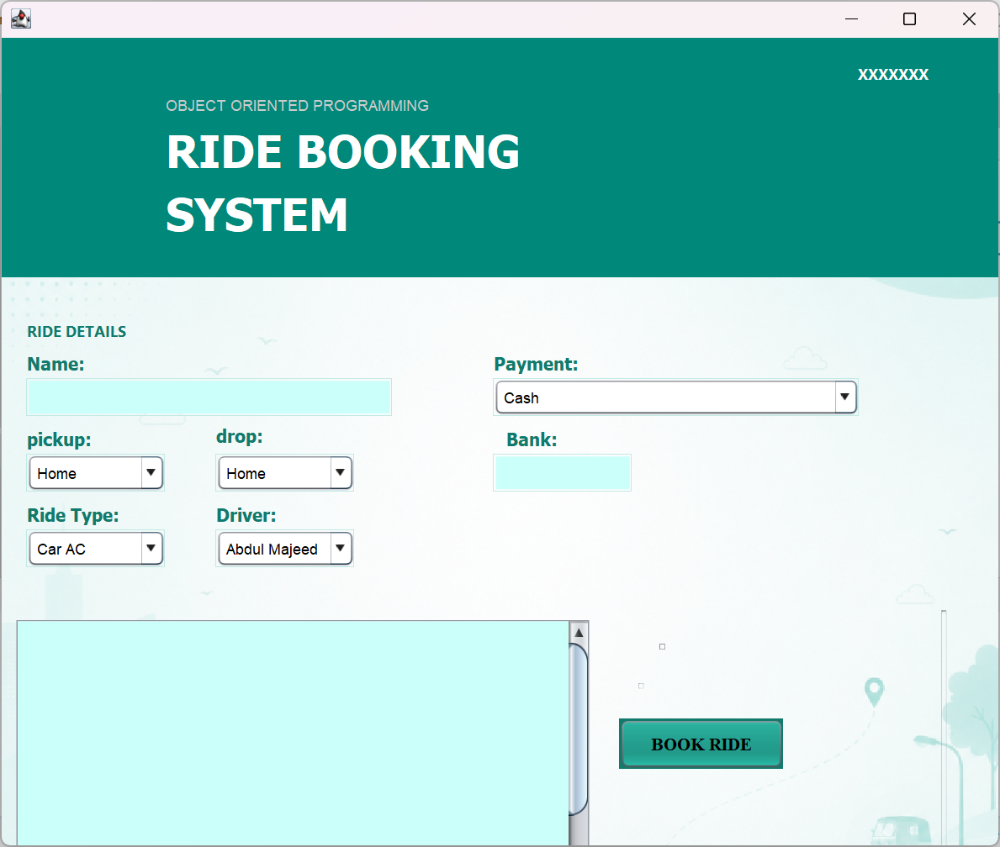
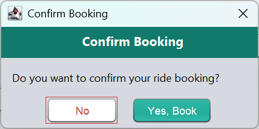
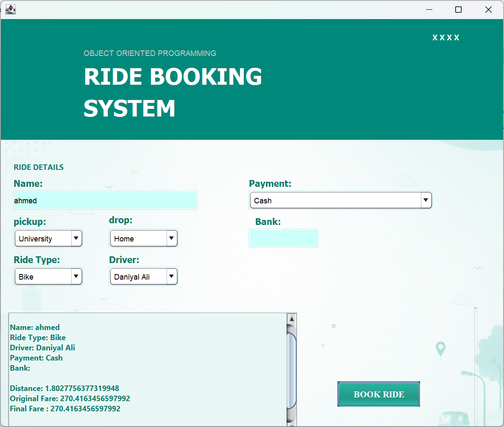
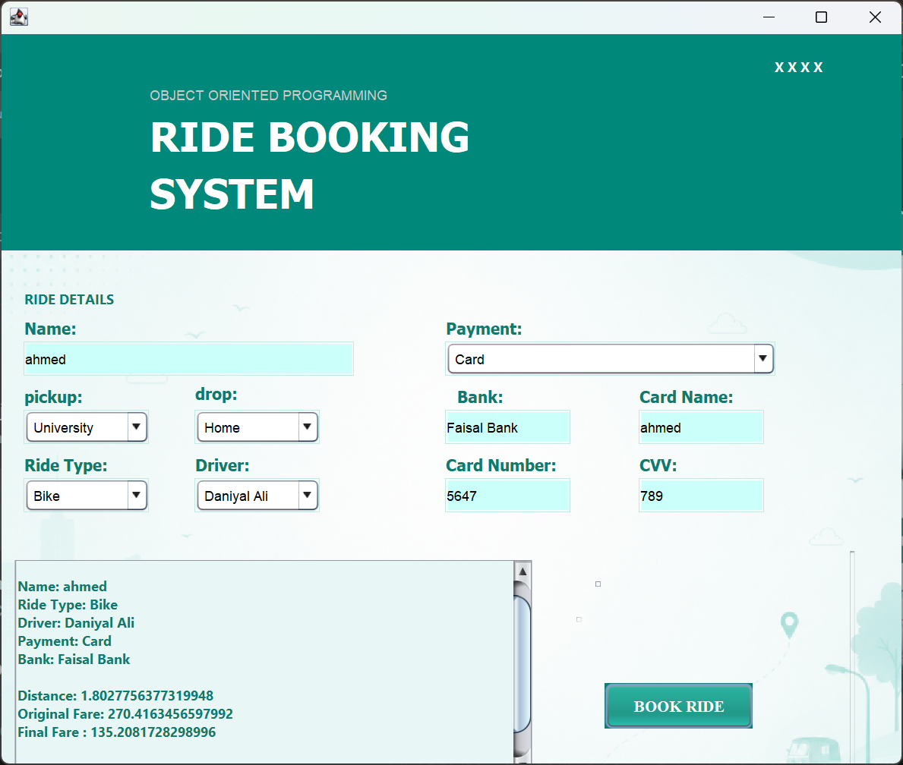
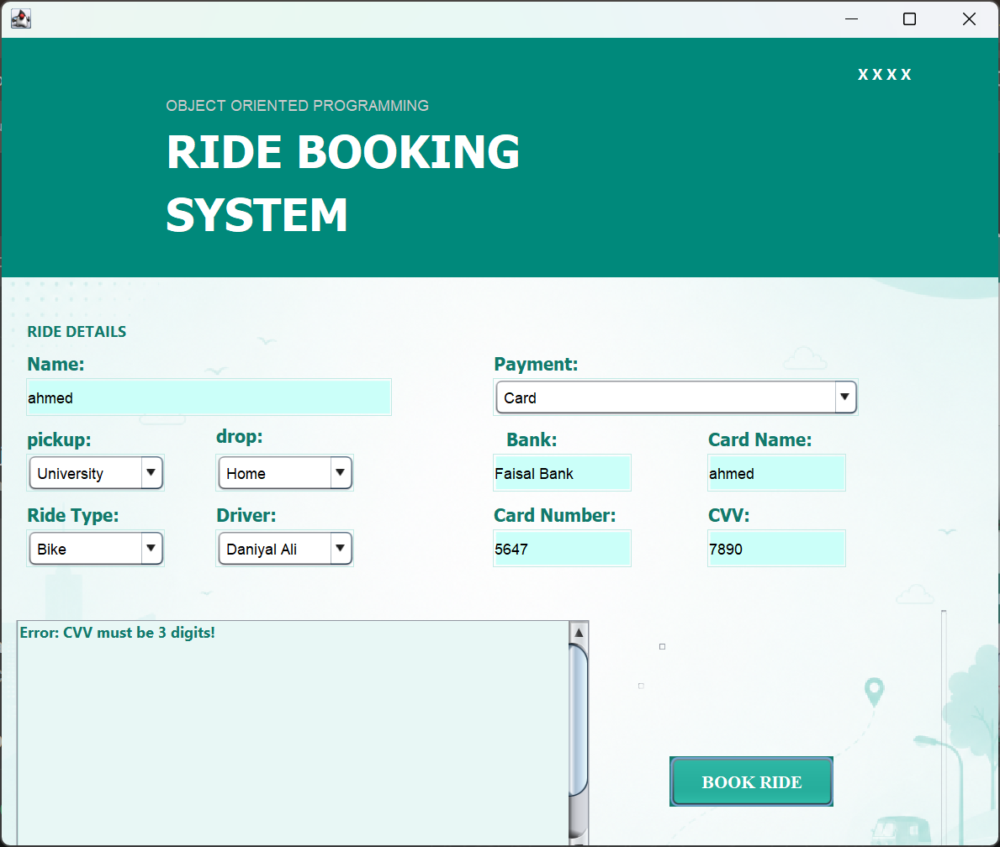
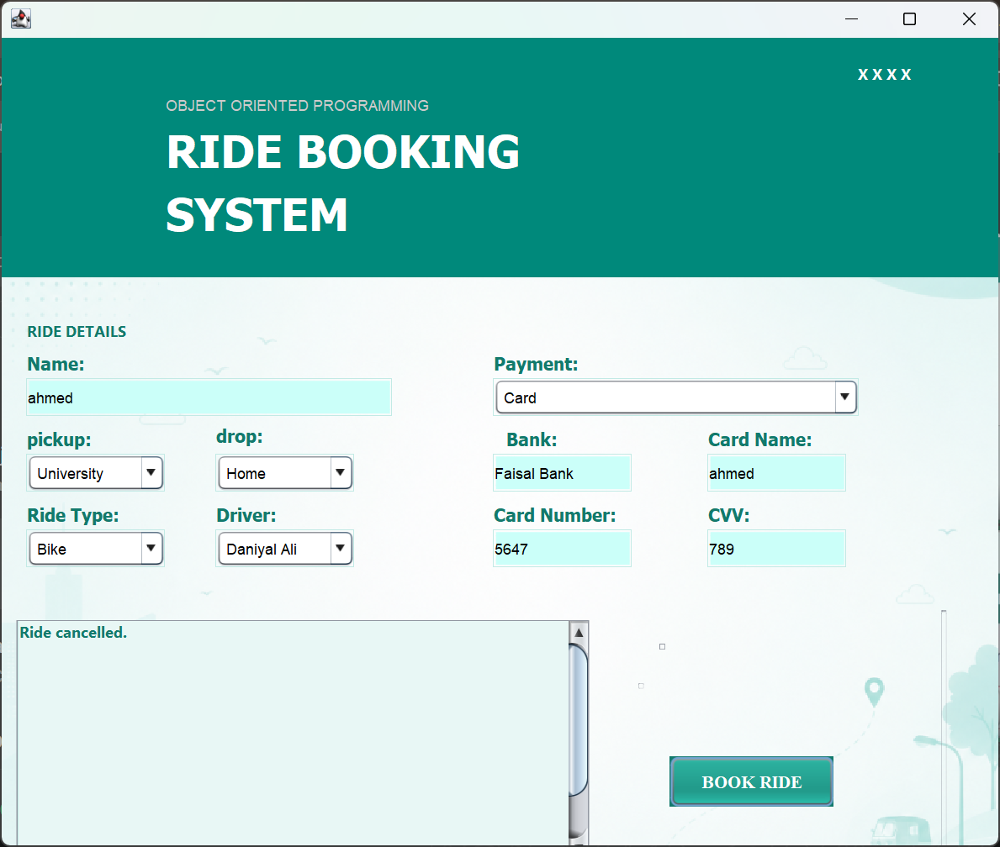
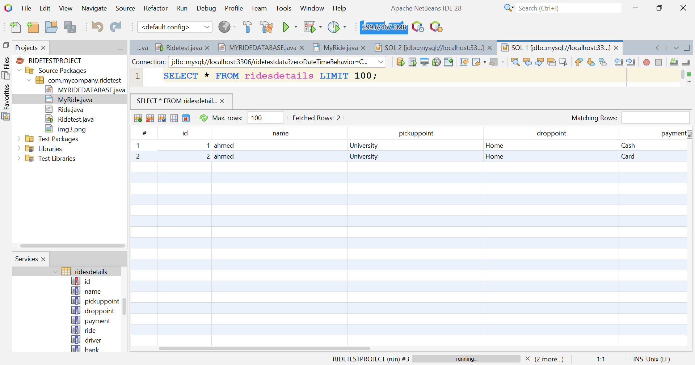
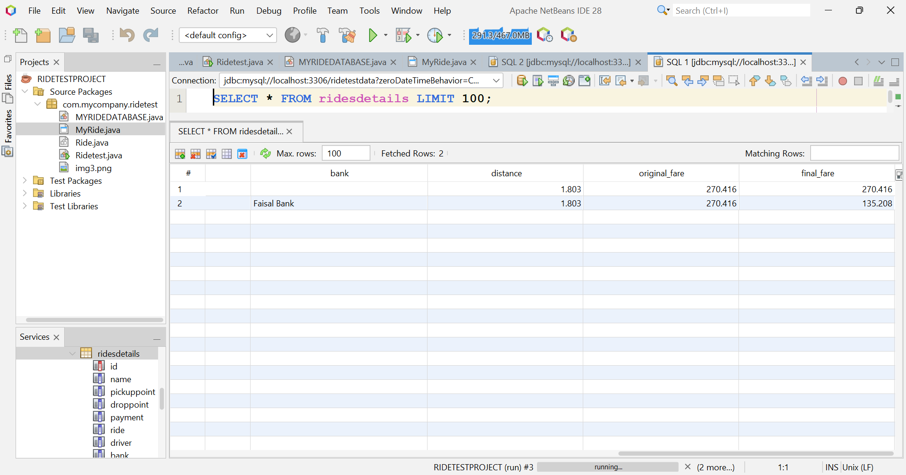

 Ride Booking System - Java NetBeans

A simple Object Oriented Programming project for booking rides. Built using Java Swing in NetBeans with MySQL database connectivity.

This project has 2 implementations:
1. **Terminal Based** - Console input/output
2. **GUI + Database** - Java Swing form connected to MySQL

## Features
- **User Input**: Enter passenger name, pickup and drop location
- **Payment Options**: Choose between Cash and Card payment
- **Booking Confirmation**: Popup confirmation after successful booking
- **Booking Cancellation**: Popup when user wants to cancel ride
- **Database Storage**: All ride details are stored in MySQL `ridedetails` table

## VISUAL VIEW

### 1. Main Booking Form
User enters Name, Ride Details, and selects Payment Method.

### 2. Booking Confirmation
Popup appears after clicking "Book Ride" button.

### 3. Cash Payment Selected
System shows message when Cash is selected.

### 4. Card Payment Selected
Card payment option screen.

### 5.Restrictions
restriction of digits.

### 5. Cancellation Of Ride
when user wants to cancel ride.

### 5. Database Table
All booking data is saved in the `ridedetails` table in MySQL.

## Tech Stack
- **Language**: Java
- **IDE**: NetBeans
- **GUI**: Java Swing
- **Database**: MySQL

## How to Run
1. Open the project in NetBeans
2. Setup MySQL database with table `ridedetails`
3. Run `Main.java`
